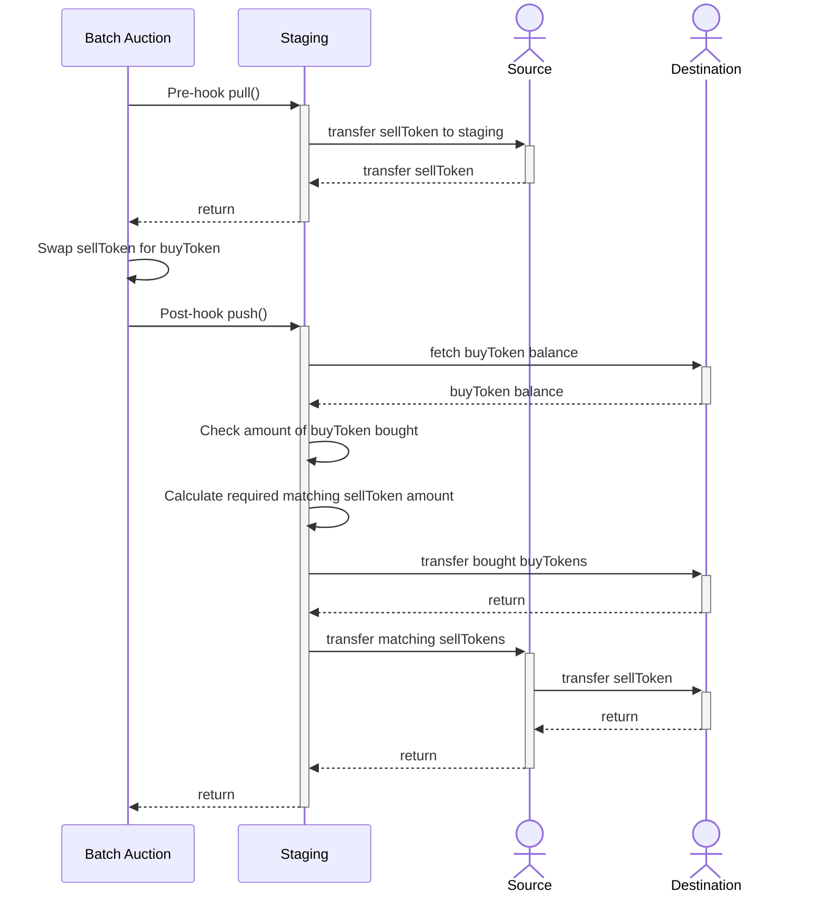

# FundingModule

## Requirements

- The module is configured on a Safe that **never** retains any funds
- The limit price of the AMM (destination) is to remain unaffected by the funding
- Allowances given to the staging Safe are protected by limiting the output of each `pull` to a maximum of `sellAmount`

### Safe never retains funds

Configuring the module on a Safe that retains funds would increase the attack surface. In this method, the Safe is only used as a staging area for the funds, and the value at risk is contained to the approvals that are set on the funding source for the staging Safe.

### Limit price remains unaffected

The limit price of the AMM (funding destination) is to remain unaffected by the funding. This is achieved by calculating the amount of `sellToken` that is required to be transferred to the AMM (funding destination) to preserve the limit price given the amount of `buyToken` that was bought by the staging Safe.

As the amount of `buyToken` that was bought is required to be known, and the staging Safe is only _selling_ (ie. the output/bought amount isn't visible in a CoW Protocol batch), the `buyToken` amount is sent to the staging safe (and simply the balance of the staging Safe is used).

### Allowance protection

The staging Safe may only at any time contain a maximum of `sellAmount` of `sellToken` (assuming the `pull()` was called out-of-auction). Then, subsequent invocations within the batch auction will simply `return`, as the staging Safe knows that it needn't do anything. This therefore prevents malicious actors draining the entire allowance of the funding source to the staging Safe, and therefore causing reverts in the `push()` function when the matching `sellToken` is transferred to the AMM (funding destination).

## Methodology

1. The source of funds can be any arbitrary address that holds the funding `sellToken`
2. A staging Safe is configured with the module enabled
3. The address from (1) sets an allowance for the staging Safe to transfer `sellToken` on its behalf
4. The staging Safe handles the selling of `sellToken` for `buyToken` using CoW Protocol's TWAP
5. The staging Safe calculates the amount of `sellToken` given the amount of `buyToken` bought to preserve the AMM's limit price
6. The staging Safe transfers the `buyToken` to the AMM (funding destination)
7. The staging Safe transfers the `sellToken` directly from (1) to the AMM (funding destination) to satisfy (5)

## Sequence diagram

